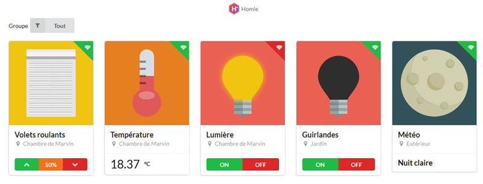

Homie server
============

[](https://www.npmjs.com/package/homie-server) [](https://travis-ci.org/marvinroger/homie-server) [](https://coveralls.io/r/marvinroger/homie-server) (broken) [](https://david-dm.org/marvinroger/homie-server) [](https://david-dm.org/marvinroger/homie-server#info=devDependencies) 

Server of Homie, an opinionated home automation system using MQTT. Built with Node.js. The project is currently in alpha.



## Features

* Simple but efficient dashboard
* OTA updates
* Compatible starting with Node.js v0.12 (0.10 might work, but it is not CI-tested)

## Installation

`npm install -g homie-server`

## Usage

The Homie server can only be started using the CLI interface. Start Homie by calling `homie`. You can optionally provide a `--dataDir` argument that will be used to store the Homie data. By default, this directory is located at `<home directory>/.homie`. You can also configure the HTTP server serving the UI with `--uiPort`, else it defaults to 80.

### Configuration

Three files define the behavior of Homie, and are all contained in the data directory:

1. The `config.yml` file. It contains some configuration like your MQTT broker address.

```yaml
mqtt:
  url: mqtt://127.0.0.1:1883
  clientId: optional client ID
  username: optional username
  password: optional password
```

2. The `infrastructure.yml` file. This file contains the representation of your Homie devices. You can also group devices there.

```yaml
devices:
  - id: abcd0123
    location: Marvin's room
    nodes:
      - type: shutters
        id: shutters
        name: Shutters
  - id: efab4567
    location: Mathys's room
    nodes:
      - type: light
        id: main
        name: Main light
      - type: light
        id: bed
        name: Bed light

groups:
  id: first-floor
  name: First floor
  devices:
    - abcd0123
    - efab4567
```

3. The `ota/manifest.yml` file. It contains a definition of the firmwares for your devices, like so:

```yaml
firmwares:
  - name: light-firmware
    version: 1.0.0
    devices:
      - marvin-lights
```

For this example manifest, you would put the firmware binary in `ota/firmwares/light-firmware.bin`, otherwise, OTA won't be handled. You can update the manifest while Homie is running, it will be hot loaded.

## Contribute

Contributions are very welcome!

To work/start the git Homie version, just run `npm run dev`.
This will build the public directory, and watch for changes in the `app` folder.
To start the server, run `npm start`. The GUI will be listening on port `3000`.
